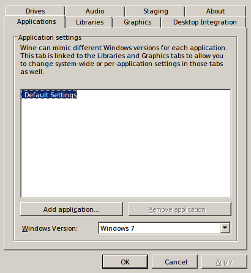

## Установка WoT через PlayOnLinux

1) **Устанавливаем PlayOnLinux:**
```
sudo apt-get install playonlinux winetricks
```

2) **Устанавливаем wine 2.3-staging**


3) **Создаем боттл**


4) **Открываем настройки боттла**


5) **Открываем настройки вайна**



6) **Выбираем Windows XP**


7) **Добавляем msvcp110 и msvcr110 в оверайды библиотек**


8) **Добавляем xaudio2_7 в disable**


9) **Включаем виртуальный рабочий стол**


10) **Включаем CSMT**


11) **Закрываем настройки вайна нажатием ОК**


12) **Устанавливаем библиотеку из DirectX**


13) **Устанавливаем размер видеопамяти**


14) **Прописываем ключи в реестр для обхода проблем с курсором**


Параметры на скришноте:

|Ключ|Значение|
|----|----|
|Decorated|N|
|GrabFullscreen|Y|
|Managed|N|
|UseTakeFocus|N|

15) **Прописываем настройку ланчера**


16) **Устанавливаем ланчер WoT**


## Для модов:
1) **Устанавливаем IE7**


2) **Скачиваем флеш из http://get.adobe.com/flashplayer/**

3) **Устанавливаем флеш**


4) **Ставим моды**
